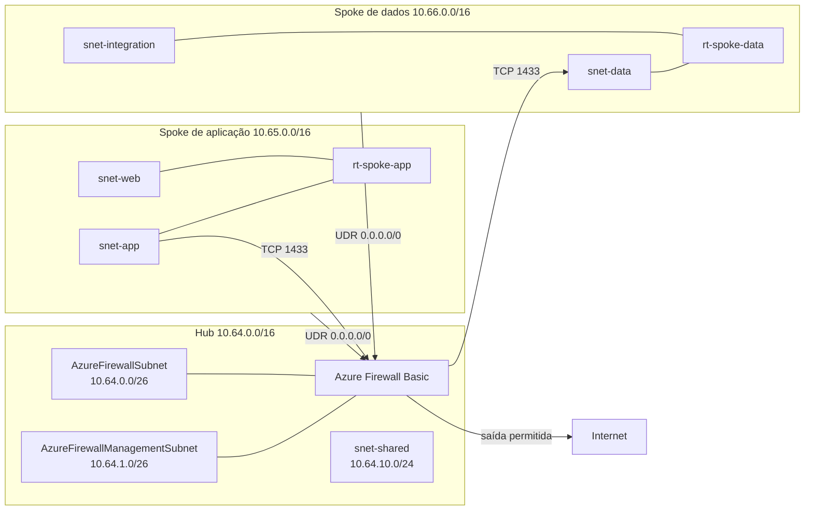

# Laboratório Azure com Terraform: Azure Firewall e rotas customizadas

Este repositório contém a parte 3 do laboratório de rede hub and spoke no Azure. Ele preserva a fundação e os NSGs da [parte 2](https://rookieops.dev/posts/rede-hub-and-spoke-azure-terraform-parte-2/) e adiciona inspeção central com Azure Firewall Basic, Firewall Policy e rotas definidas pelo usuário.

O artigo completo desta etapa será publicado em [Rede hub and spoke no Azure com Terraform, parte 3](https://rookieops.dev/posts/rede-hub-and-spoke-azure-terraform-parte-3/).

## Arquitetura



As UDRs das quatro subnets de workload usam o IP privado do firewall como próximo salto. `AzureFirewallSubnet`, `AzureFirewallManagementSubnet` e `snet-shared` não recebem a rota padrão, o que evita enviar o próprio tráfego do firewall de volta para ele.

A SKU Basic exige duas subnets dedicadas com prefixo mínimo `/26`: `AzureFirewallSubnet` transporta o tráfego de dados e `AzureFirewallManagementSubnet` separa o plano de gerenciamento. Cada configuração também usa um IP público Standard e estático.

## Recursos previstos

| Tipo | Quantidade | Observação |
| --- | ---: | --- |
| Resource group | 3 | Herdados das partes anteriores |
| VNet | 3 | Herdadas das partes anteriores |
| Subnet | 7 | Cinco herdadas e duas dedicadas ao firewall |
| VNet peering | 4 | Atualizados para aceitar tráfego encaminhado |
| NSG | 4 | Atualizados com os fluxos permitidos desta parte |
| Associação entre subnet e NSG | 4 | Herdadas da parte 2 |
| IP público | 2 | Dados e gerenciamento do firewall |
| Azure Firewall | 1 | SKU Basic |
| Firewall Policy | 1 | SKU Basic, inteligência de ameaças em modo de alerta |
| Rule collection group | 1 | Regras de rede e aplicação |
| Route table | 2 | Uma por spoke |
| Associação entre subnet e route table | 4 | Uma para cada subnet de workload |

A configuração completa gerencia 36 recursos. Em um diretório sem state, o plano esperado é `36 to add`. Ao continuar com o state da parte 2, a expectativa é `13 to add` e `8 to change`: quatro peerings e quatro NSGs mudam no próprio recurso.

## Política de tráfego

O Azure Firewall nega por padrão o tráfego que não corresponde a uma coleção com ação `Allow`. O laboratório declara apenas estes fluxos:

| Coleção | Prioridade | Regra | Origem | Destino | Protocolo e porta | Ação |
| --- | ---: | --- | --- | --- | --- | --- |
| `allow-east-west` | 100 | `allow-app-to-data` | `10.65.20.0/24` | `10.66.10.0/24` | TCP 1433 | Permitir |
| `allow-system-updates` | 200 | `allow-windows-update` | Spokes de aplicação e dados | Tag FQDN `WindowsUpdate` | HTTPS 443 | Permitir |
| Padrão da policy | Última avaliação | Sem correspondência | Qualquer | Qualquer | Qualquer | Negar |

A tag FQDN `WindowsUpdate` é mantida pela Microsoft e pode incluir endpoints que usam HTTP mesmo quando a regra de aplicação declara HTTPS 443. Por isso, os NSGs permitem TCP 80 e 443 para destinos classificados pela marca de serviço `Internet`. O firewall continua decidindo quais destinos de atualização são aceitos.

O laboratório usa o DNS fornecido pela plataforma. O endereço virtual `168.63.129.16` recebe tratamento especial no Azure e não é encaminhado pela rota padrão para o firewall. Para inspecionar DNS de forma central, seria necessário habilitar o DNS Proxy e apontar as VNets para ele, uma mudança que não faz parte desta etapa.

Não há regras de NAT ou DNAT de entrada, inspeção TLS, VPN Gateway, ExpressRoute ou Bastion.

## Estrutura do repositório

```text
.
|-- .github/
|   `-- workflows/
|       `-- terraform-check.yml
|-- environments/
|   `-- lab/
|       |-- backend.tf
|       |-- main.tf
|       |-- outputs.tf
|       |-- providers.tf
|       |-- terraform.tfvars.example
|       |-- variables.tf
|       `-- versions.tf
|-- modules/
|   |-- firewall/
|   |   |-- main.tf
|   |   |-- outputs.tf
|   |   `-- variables.tf
|   |-- network-security-group/
|   |   |-- main.tf
|   |   |-- outputs.tf
|   |   `-- variables.tf
|   |-- route-table/
|   |   |-- main.tf
|   |   |-- outputs.tf
|   |   `-- variables.tf
|   `-- virtual-network/
|       |-- main.tf
|       |-- outputs.tf
|       `-- variables.tf
|-- .gitignore
|-- LICENSE
`-- README.md
```

O módulo `firewall` cria os dois IPs públicos, a Firewall Policy, o grupo de coleções e o Azure Firewall. O ambiente informa `sku_name = "AZFW_VNet"` e `sku_tier = "Basic"`, e o módulo aplica o mesmo tier ao firewall e à policy. O módulo `route-table` cria uma rota padrão com próximo salto `VirtualAppliance` e associa a tabela às subnets recebidas em um mapa.

## Pré-requisitos

- assinatura do Azure usada somente para estudos;
- Azure CLI instalada e autenticada;
- Terraform `1.15.8`;
- provider AzureRM `4.79.0`;
- Git para trabalhar em seu fork.

Os exemplos usam PowerShell. Em Bash, use `cd` no lugar de `Set-Location` e `cp` no lugar de `Copy-Item`.

## Configurar o ambiente

Crie o arquivo local de variáveis:

```powershell
Copy-Item environments/lab/terraform.tfvars.example environments/lab/terraform.tfvars
```

Edite `environments/lab/terraform.tfvars` e substitua `subscription_id` e `owner`. Confirme o contexto da Azure CLI antes de gerar o plano:

```powershell
az login
az account set --subscription "<SUBSCRIPTION_ID>"
az account show --query "{nome:name, subscriptionId:id, tenantId:tenantId}" --output table
```

Pare se o tenant ou a assinatura não forem os esperados. Arquivos `*.tfvars`, state e planos são ignorados pelo Git, mas ainda precisam ser tratados como dados sensíveis.

## Formatar, inicializar e validar

Na raiz do repositório:

```powershell
terraform fmt -check -recursive .
Set-Location environments/lab
terraform init
terraform validate
terraform plan -out=plan.tfplan
terraform show plan.tfplan
```

Revise nomes, CIDRs, regras, associações, mudanças nos peerings, IP privado usado como próximo salto e a assinatura. Não execute `terraform apply` sem uma revisão separada e autorização explícita. Este laboratório termina na geração e na revisão do plano.

O workflow de GitHub Actions permanece restrito a `fmt`, `init -backend=false` e `validate`. Ele não cria, altera ou destrói recursos do Azure.

## Custos, segurança e reversão

O Azure Firewall gera cobrança contínua enquanto permanece provisionado, mesmo sem tráfego. Transferência e processamento de dados também podem gerar custos. Consulte a [Calculadora de Preços do Azure](https://azure.microsoft.com/pt-br/pricing/calculator/) para a região e o cenário atuais.

Se você aplicar este laboratório por conta própria, destrua os recursos assim que terminar os testes e confira a assinatura antes de confirmar qualquer operação. O código deste repositório não executa `apply` nem `destroy` automaticamente.

Uma UDR incorreta pode interromper DNS, atualizações, acesso a APIs e comunicação entre spokes. Revise as rotas efetivas e mantenha regras simétricas nos NSGs das duas pontas. O firewall é stateful, mas ainda precisa receber o caminho de ida e de volta.

## Licença

O código deste laboratório é distribuído sob a licença MIT. Consulte [LICENSE](LICENSE).
